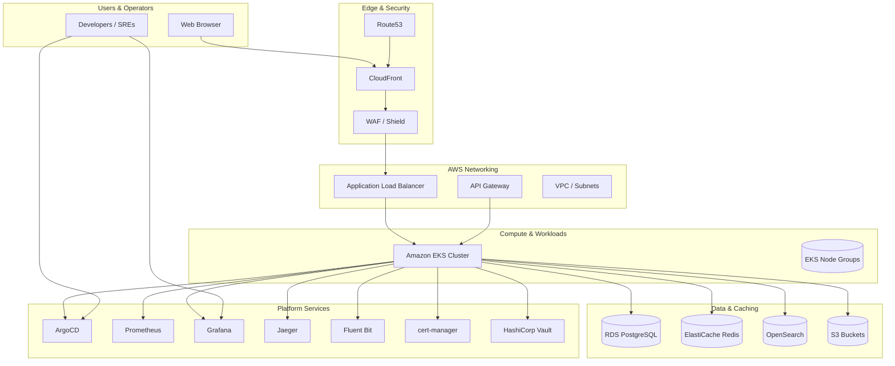
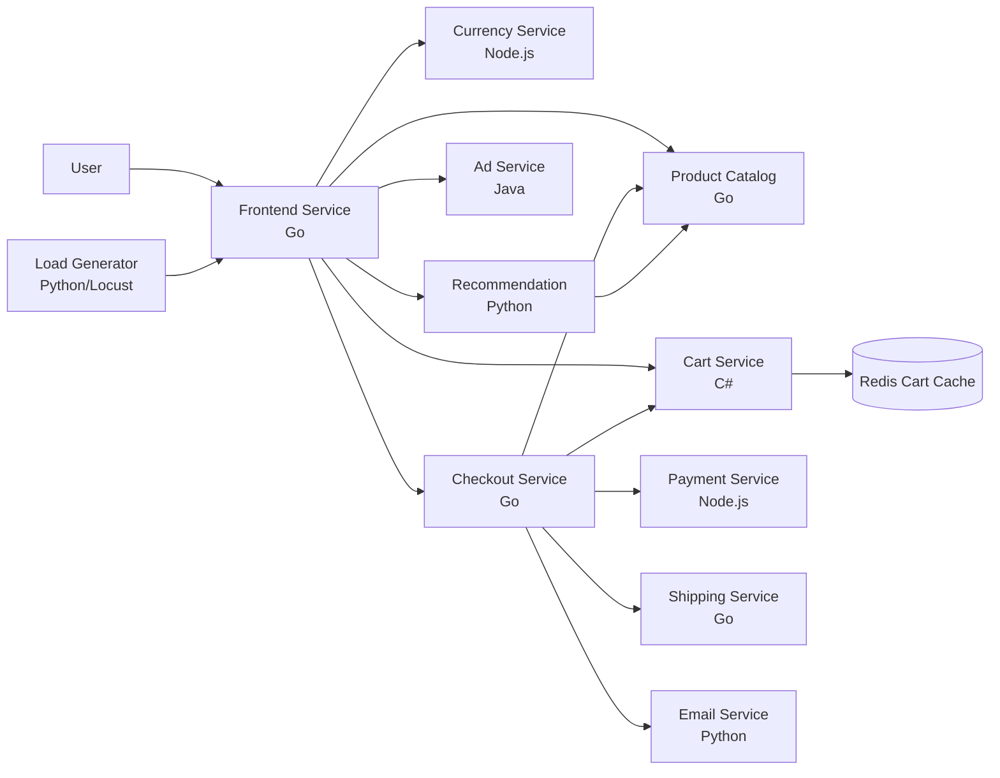
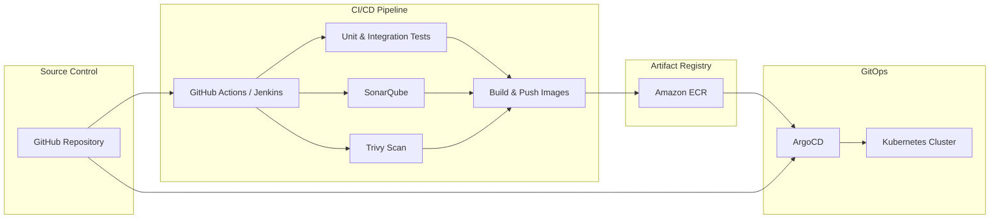
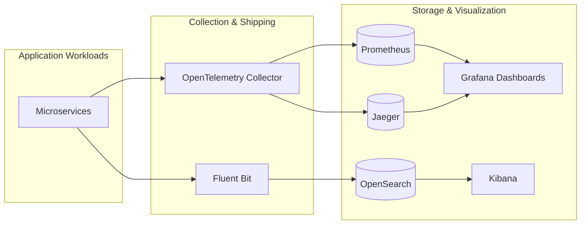

<p align="center">
  
</p>

<h1 align="center">Enterprise E-Commerce DevOps Microservices Platform</h1>

<p align="center">
  A production-grade, cloud-native e-commerce reference platform demonstrating modern enterprise DevOps, GitOps, Kubernetes, Terraform, observability, and DevSecOps practices.
</p>

<p align="center">
  <a href="https://github.com/HariPolavarapu/enterprise-ecommerce-devops-microservices-platform/actions">
    
  </a>
  <a href="#kubernetes">
    
  </a>
  <a href="#terraform">
    
  </a>
  <a href="#gitops">
    
  </a>
  <a href="#observability">
    
  </a>
  <a href="LICENSE">
    
  </a>
</p>

---

## Table of Contents

- [Purpose](#purpose)
- [Features](#features)
- [Architecture](#architecture)
  - [High-Level Platform Architecture](#high-level-platform-architecture)
  - [Microservices Architecture](#microservices-architecture)
  - [CI/CD & GitOps Flow](#cicd--gitops-flow)
  - [Observability Stack](#observability-stack)
- [Repository Structure](#repository-structure)
- [Technologies Used](#technologies-used)
- [Prerequisites](#prerequisites)
- [Deployment](#deployment)
  - [Local Development](#local-development)
  - [AWS + EKS Deployment](#aws--eks-deployment)
  - [GitOps with ArgoCD](#gitops-with-argocd)
- [Screenshots](#screenshots)
- [Contributing](#contributing)
- [License](#license)
- [Author](#author)

---

## Purpose

The **Enterprise E-Commerce DevOps Microservices Platform** is a cloud-first, production-oriented reference application that modernizes a traditional monolithic online store into a resilient, observable, and secure microservices ecosystem.

It solves real-world enterprise problems that organizations face when scaling cloud-native applications:

| Problem | How This Platform Solves It |
|--------|------------------------------|
| **Slow, error-prone releases** | End-to-end CI/CD pipelines with automated build, test, security scan, and GitOps-driven deployments. |
| **Environment drift** | Terraform-managed infrastructure and GitOps-managed Kubernetes manifests ensure consistency across dev, QA, staging, and production. |
| **Operational blind spots** | Full-stack observability with metrics, logs, traces, and alerting using Prometheus, Grafana, Jaeger, Fluent Bit, and OpenTelemetry. |
| **Security gaps** | DevSecOps controls including RBAC, network policies, cert-manager, external secrets, vulnerability scanning (Trivy), and IAM hardening. |
| **Complex local development** | Docker Compose-based local environment lets developers spin up the full stack quickly. |
| **Manual scaling and failover** | Kubernetes-native autoscaling, health probes, and multi-account AWS landing zone architecture. |

Whether you are a platform engineer building an internal developer platform, an SRE designing observability standards, or a DevOps practitioner learning GitOps and infrastructure-as-code, this repository provides a realistic, end-to-end blueprint.

---

## Features

### Application Features

- Browse a catalog of products with search and recommendations.
- Add items to a shopping cart backed by Redis.
- Convert currencies in real time using live exchange rates.
- Checkout with mock payment, shipping cost estimation, and order confirmation email.
- AI/ML-powered product recommendations based on cart contents.
- Ad service that serves contextual text ads.
- Load generator that simulates realistic user traffic.

### Enterprise DevOps Features

| Capability | Implementation |
|------------|----------------|
| **Cloud Infrastructure** | AWS Organizations, EKS, ECR, ALB, API Gateway, Route53, CloudFront, WAF, RDS PostgreSQL, ElastiCache Redis, S3, OpenSearch, Lambda, EventBridge, SNS/SQS. |
| **Infrastructure as Code** | Terraform modules + Ansible playbooks for repeatable, version-controlled infrastructure. |
| **Container Orchestration** | Kubernetes manifests, Helm charts, and Skaffold for local-to-production parity. |
| **CI/CD** | GitHub Actions and Jenkins pipelines with build, test, SonarQube analysis, Trivy scanning, and artifact publishing. |
| **GitOps** | ArgoCD continuously reconciles cluster state from this repository. |
| **Observability** | Prometheus metrics, Grafana dashboards, Fluent Bit log shipping, OpenSearch/Kibana, Jaeger distributed tracing, and OpenTelemetry instrumentation. |
| **DevSecOps** | Network policies, RBAC, cert-manager TLS, External Secrets Operator, Vault integration, IAM roles, and container image scanning. |
| **Local Development** | Docker Compose environment for rapid feedback loops. |

---

## Architecture

### High-Level Platform Architecture



### Microservices Architecture



The application is composed of **10 microservices** communicating over **gRPC** plus a Redis-backed cart cache and a Locust-based load generator.

| Service | Language | Description |
|---------|----------|-------------|
| `frontend` | Go | Serves the web UI, manages sessions, and aggregates downstream calls. |
| `productcatalogservice` | Go | Provides product catalog, search, and individual product retrieval. |
| `cartservice` | C# | Persists user shopping carts in Redis. |
| `currencyservice` | Node.js | Converts amounts between currencies using live ECB rates. |
| `paymentservice` | Node.js | Simulates credit card charging and returns transaction IDs. |
| `shippingservice` | Go | Calculates shipping costs and simulates order shipment. |
| `emailservice` | Python | Sends mock order confirmation emails. |
| `checkoutservice` | Go | Orchestrates the checkout flow across cart, payment, shipping, and email. |
| `recommendationservice` | Python | Recommends products based on current cart contents. |
| `adservice` | Java | Returns contextual ads based on product keywords. |
| `loadgenerator` | Python/Locust | Simulates realistic shopper traffic against the frontend. |

Protocol Buffers definitions are located in the [`protos/`](./protos) directory.

### CI/CD & GitOps Flow



1. A developer pushes code or opens a pull request.
2. GitHub Actions or Jenkins run tests, static analysis, and security scans.
3. Container images are built, scanned with Trivy, and pushed to Amazon ECR.
4. ArgoCD watches the repository and continuously reconciles the desired state into the EKS cluster.
5. Production deployments are progressive, auditable, and fully traceable.

### Observability Stack



| Signal | Tool | Use Case |
|--------|------|----------|
| Metrics | Prometheus + Grafana | Latency, throughput, error rates, resource utilization, SLO dashboards. |
| Logs | Fluent Bit + OpenSearch + Kibana | Centralized log aggregation, search, and alerting. |
| Traces | OpenTelemetry + Jaeger | Distributed request tracing and bottleneck analysis. |
| Alerts | Prometheus Alertmanager + Grafana | Proactive incident notification. |

---

## Repository Structure

```text
enterprise-ecommerce-devops-microservices-platform/
├── microservices/            # Containerized e-commerce microservices
├── src/                      # Source code (Go, Node.js, Python, C#, Java)
├── protos/                   # gRPC / Protocol Buffers definitions
├── terraform/                # Infrastructure as Code for AWS
├── infrastructure/           # Ansible playbooks and additional IaC
├── kubernetes/               # Kubernetes manifests for app and platform clusters
├── platform/                 # Platform services: GitOps, monitoring, ingress
├── gitops/                   # ArgoCD applications and Helm charts
├── cicd/                     # GitHub Actions and Jenkins pipelines
├── observability/            # Prometheus, Grafana, Fluent Bit, Jaeger, OpenTelemetry
├── security/                 # RBAC, network policies, Vault, cert-manager, IAM
├── local-development/        # Docker Compose local environment
├── automation/               # Helper scripts (Bash, Python, Lambda)
├── docs/                     # Architecture diagrams, guides, runbooks
├── scripts/                  # Operational and deployment scripts
├── tools/                    # Additional tooling
├── skaffold.yaml             # Skaffold configuration
├── cloudbuild.yaml           # Google Cloud Build configuration
├── LICENSE                   # Apache 2.0 License
└── README.md                 # This file
```

For detailed guidance on adding a new microservice, see [`docs/adding-new-microservice.md`](./docs/adding-new-microservice.md).

---

## Technologies Used

### Cloud & Infrastructure

- **AWS:** EKS, ECR, ALB, API Gateway, Route53, CloudFront, WAF, Shield, ACM, RDS PostgreSQL, ElastiCache Redis, S3, OpenSearch, CloudWatch, Lambda, EventBridge, SNS, SQS.
- **Terraform:** Modular, reusable infrastructure definitions.
- **Ansible:** Configuration management and bootstrapping.
- **Google Cloud:** Optional Cloud Build and GKE deployment path.

### Application Stack

- **Languages:** Go, Node.js, Python, C# (.NET), Java.
- **Communication:** gRPC and Protocol Buffers.
- **Frontend:** Server-side rendered web UI.
- **Caching:** Redis.
- **Databases:** PostgreSQL, Redis, OpenSearch.

### DevOps & Platform Engineering

- **CI/CD:** GitHub Actions, Jenkins, Maven, SonarQube, Trivy, Nexus.
- **GitOps:** ArgoCD, Helm.
- **Container Orchestration:** Kubernetes, Docker, Skaffold.
- **Security:** Vault, cert-manager, External Secrets Operator, RBAC, network policies, IAM.
- **Observability:** Prometheus, Grafana, Fluent Bit, OpenSearch, Kibana, OpenTelemetry, Jaeger.

---

## Prerequisites

Choose the deployment path that matches your environment.

### Common Tools

| Tool | Version | Purpose |
|------|---------|---------|
| `git` | Latest | Clone and version control. |
| `docker` | 24.x+ | Build and run containers locally. |
| `docker-compose` | 2.x+ | Local multi-service orchestration (shared services). |
| `kubectl` | 1.28+ | Interact with Kubernetes clusters. |
| `helm` | 3.12+ | Install Helm charts. |
| `terraform` | 1.5+ | Provision AWS infrastructure. |
| `aws-cli` | 2.x+ | Manage AWS resources. |
| `argocd` CLI | Latest | Manage ArgoCD applications. |
| `skaffold` | 2.0.2+ | Local Kubernetes development workflow. |

### AWS Deployment Prerequisites

- An AWS account with Organizations enabled (management, security, networking, shared services, dev, QA, pre-prod, prod).
- IAM permissions to create EKS, ECR, RDS, ElastiCache, S3, and networking resources.
- A configured `aws-cli` profile.

### Local Development Prerequisites

- Docker Desktop with Kubernetes enabled (or [Minikube](https://minikube.sigs.k8s.io/) / [Kind](https://kind.sigs.k8s.io/)).
- [Skaffold](https://skaffold.dev/docs/install/) 2.0.2+ installed.
- At least **8 GB of RAM** allocated to Docker / local Kubernetes.

---

## Deployment

### Local Development

The recommended way to run the full application locally is with **Skaffold** and a local Kubernetes cluster (kind, Minikube, or Docker Desktop Kubernetes).

#### Prerequisites

- [Docker Desktop](https://www.docker.com/products/docker-desktop) with Kubernetes enabled (or [Minikube](https://minikube.sigs.k8s.io/) / [Kind](https://kind.sigs.k8s.io/))
- [kubectl](https://kubernetes.io/docs/tasks/tools/) 1.28+
- [Skaffold](https://skaffold.dev/docs/install/) 2.0.2+

#### Quickstart

1. Clone the repository:

   ```sh
   git clone https://github.com/HariPolavarapu/enterprise-ecommerce-devops-microservices-platform.git
   cd enterprise-ecommerce-devops-microservices-platform
   ```

2. Start a local Kubernetes cluster:

   ```sh
   # Option A: Kind (recommended for CI-like environment)
   kind create cluster

   # Option B: Minikube
   minikube start --cpus=4 --memory 4096 --disk-size 32g

   # Option C: Docker Desktop Kubernetes
   # Enable Kubernetes in Docker Desktop Settings → Kubernetes
   ```

3. Deploy the application with Skaffold:

   ```sh
   skaffold run
   ```

   > First run takes ~10-20 minutes to build all images. For iterative development, use `skaffold dev` for auto-rebuild on code changes.

4. Access the storefront:

   ```sh
   kubectl port-forward deployment/frontend 8080:8080
   ```

   Then open **http://localhost:8080** in your browser (or `http://127.0.0.1:8080` on Windows/Linux).

5. Verify all pods are running:

   ```sh
   kubectl get pods
   ```

For more details, see [`docs/development-guide.md`](./docs/development-guide.md).

### AWS + EKS Deployment

> **Note:** This is a multi-step enterprise deployment. Review and customize the Terraform variables in `terraform/terraform.tfvars` before proceeding.

1. Configure your AWS credentials and target region:

   ```sh
   export AWS_PROFILE=your-profile
   export AWS_REGION=us-east-1
   ```

2. Update Terraform variables:

   ```sh
   cp terraform/terraform.tfvars terraform/terraform.tfvars.local
   # Edit terraform/terraform.tfvars.local with your project ID, region, and flags.
   ```

3. Initialize and apply the platform infrastructure:

   ```sh
   cd terraform
   terraform init
   terraform plan -var-file="terraform.tfvars.local"
   terraform apply -var-file="terraform.tfvars.local"
   ```

4. Configure `kubectl` to point to the new EKS cluster:

   ```sh
   aws eks update-kubeconfig --region $AWS_REGION --name enterprise-ecommerce-cluster
   ```

5. Deploy the platform services:

   ```sh
   kubectl apply -k platform/kubernetes/
   ```

6. Deploy the application:

   ```sh
   kubectl apply -k kubernetes/application-clusters/
   ```

7. Wait for pods to be ready:

   ```sh
   kubectl wait --for=condition=ready pod --all -n ecommerce --timeout=300s
   ```

8. Access the application:

   ```sh
   kubectl get service frontend-external -n ecommerce
   ```

   Visit the `EXTERNAL-IP` shown in your browser.

### GitOps with ArgoCD

1. Install ArgoCD in the cluster:

   ```sh
   kubectl create namespace argocd
   kubectl apply -n argocd -f https://raw.githubusercontent.com/argoproj/argo-cd/stable/manifests/install.yaml
   ```

2. Port-forward the ArgoCD UI:

   ```sh
   kubectl port-forward svc/argocd-server -n argocd 8080:443
   ```

3. Log in and apply the root application:

   ```sh
   argocd login localhost:8080
   kubectl apply -f gitops/applications/root-app.yaml
   ```

4. ArgoCD will now continuously reconcile all platform and application resources from this repository.

---

## Screenshots

| Home Page | Checkout Screen |
|-----------|-----------------|
|  |  |

> **Placeholder for additional screenshots:** Add images here for ArgoCD, Grafana dashboards, Jaeger traces, and Terraform plan outputs as they become available.

---

## Contributing

Contributions are welcome! Please follow these guidelines to keep the project maintainable and aligned with its purpose.

1. **Fork** the repository and create a feature branch.
2. **Open an issue** first for substantial changes or new features.
3. **Follow existing patterns** for Terraform modules, Kubernetes manifests, and microservice structure.
4. **Keep the default quickstart simple.** Advanced features should be opt-in via Kustomize components or GitHub Actions inputs.
5. **Test locally** using Docker Compose or kind before submitting.
6. **Run linters and security scanners** (`trivy`, `terraform validate`, `helm lint`).
7. **Submit a pull request** with a clear description, screenshots if applicable, and references to any related issues.

Please review [`docs/development-guide.md`](./docs/development-guide.md) for local development instructions and [`docs/product-requirements.md`](./docs/product-requirements.md) for acceptance criteria.

---

## License

This project is licensed under the **Apache License 2.0**. See [`LICENSE`](./LICENSE) for the full text.

---

## Author

**Hari Krishna**

- **GitHub:** [https://github.com/HariPolavarapu](https://github.com/HariPolavarapu)

---

<p align="center">
  If you find this project useful, please ⭐ star the repository!
</p>
