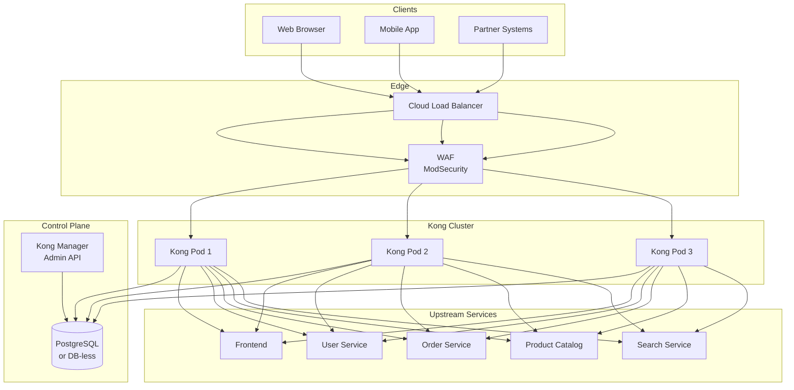

# API Gateway Design (Kong)

## Overview

Kong Gateway (OSS) serves as the single entry point for all external traffic, providing authentication, authorization, rate limiting, routing, and observability.

---

## Architecture



---

## Deployment

### Kubernetes Resources

```yaml
# kong-gateway.yaml
apiVersion: v1
kind: Namespace
metadata:
  name: kong
---
apiVersion: v1
kind: Service
metadata:
  name: kong-gateway
  namespace: kong
spec:
  type: LoadBalancer
  selector:
    app: kong
  ports:
  - name: http
    port: 80
    targetPort: 8000
  - name: https
    port: 443
    targetPort: 8443
  - name: admin
    port: 8001
    targetPort: 8001
---
apiVersion: apps/v1
kind: Deployment
metadata:
  name: kong
  namespace: kong
spec:
  replicas: 3
  selector:
    matchLabels:
      app: kong
  template:
    metadata:
      labels:
        app: kong
      annotations:
        sidecar.istio.io/inject: "true"
    spec:
      serviceAccountName: kong
      containers:
      - name: kong
        image: kong:3.4
        env:
        - name: KONG_DATABASE
          value: "postgres"
        - name: KONG_PG_HOST
          value: "postgresql.kong.svc.cluster.local"
        - name: KONG_PG_PASSWORD_FILE
          value: "/vault/secrets/pg-password"
        - name: KONG_DECLARATIVE_CONFIG
          value: "/kong/declarative/kong.yml"
        - name: KONG_PROXY_ACCESS_LOG
          value: "/dev/stdout"
        - name: KONG_ADMIN_ACCESS_LOG
          value: "/dev/stdout"
        - name: KONG_LOG_LEVEL
          value: "info"
        - name: KONG_PLUGINS
          value: "bundled,jwt,rate-limiting,acl,cors,request-transformer,response-transformer,prometheus,request-termination,ip-restriction,bot-detection"
        ports:
        - containerPort: 8000
        - containerPort: 8443
        - containerPort: 8001
        volumeMounts:
        - name: declarative-config
          mountPath: /kong/declarative
        - name: vault-secrets
          mountPath: /vault/secrets
          readOnly: true
        resources:
          requests:
            cpu: "500m"
            memory: "512Mi"
          limits:
            cpu: "1000m"
            memory: "1Gi"
        readinessProbe:
          httpGet:
            path: /status/ready
            port: 8001
          initialDelaySeconds: 10
          periodSeconds: 10
        livenessProbe:
          httpGet:
            path: /status/live
            port: 8001
          initialDelaySeconds: 30
          periodSeconds: 30
      volumes:
      - name: declarative-config
        configMap:
          name: kong-declarative-config
      - name: vault-secrets
        csi:
          driver: secrets-store.csi.k8s.io
          readOnly: true
          volumeAttributes:
            secretProviderClass: "kong-vault-secrets"
---
apiVersion: v1
kind: ConfigMap
metadata:
  name: kong-declarative-config
  namespace: kong
data:
  kong.yml: |
    _format_version: "3.0"
    _transform: true
    
    services:
    - name: frontend
      url: http://frontend.default.svc.cluster.local:80
      routes:
      - name: frontend-route
        paths:
        - /
        strip_path: false
        preserve_host: true
      plugins:
      - name: jwt
      - name: rate-limiting
        config:
          minute: 1000
          hour: 10000
          policy: redis
          redis_host: redis-cluster.kong.svc.cluster.local
          redis_port: 6379
          fault_tolerant: true
      - name: cors
        config:
          origins:
          - "*"
          methods:
          - GET
          - POST
          - PUT
          - DELETE
          - OPTIONS
          headers:
          - Authorization
          - Content-Type
          - X-Request-ID
          exposed_headers:
          - X-Request-ID
          credentials: true
          max_age: 3600
      - name: prometheus
      - name: request-transformer
        config:
          add:
            headers:
            - "X-Forwarded-Prefix:/"
    
    - name: user-api
      url: http://user-service.default.svc.cluster.local:8080
      routes:
      - name: user-api-route
        paths:
        - /api/v1/users
        strip_path: true
      plugins:
      - name: jwt
      - name: acl
        config:
          allow:
          - customer
          - admin
          - support
      - name: rate-limiting
        config:
          minute: 100
          policy: redis
          redis_host: redis-cluster.kong.svc.cluster.local
      - name: prometheus
    
    - name: order-api
      url: http://order-service.default.svc.cluster.local:8080
      routes:
      - name: order-api-route
        paths:
        - /api/v1/orders
        strip_path: true
      plugins:
      - name: jwt
      - name: acl
        config:
          allow:
          - customer
          - admin
          - support
      - name: rate-limiting
        config:
          minute: 200
          policy: redis
          redis_host: redis-cluster.kong.svc.cluster.local
      - name: prometheus
    
    - name: product-api
      url: http://product-catalog-service.default.svc.cluster.local:3550
      routes:
      - name: product-api-route
        paths:
        - /api/v1/products
        strip_path: true
      plugins:
      - name: jwt
      - name: rate-limiting
        config:
          minute: 500
          policy: redis
          redis_host: redis-cluster.kong.svc.cluster.local
      - name: caching
        config:
          cache_ttl: 300
          strategy: memory
      - name: prometheus
    
    - name: search-api
      url: http://search-service.default.svc.cluster.local:8080
      routes:
      - name: search-api-route
        paths:
        - /api/v1/search
        strip_path: true
      plugins:
      - name: jwt
      - name: rate-limiting
        config:
          minute: 300
          policy: redis
          redis_host: redis-cluster.kong.svc.cluster.local
      - name: prometheus
    
    consumers:
    - username: keycloak-client
      custom_id: "keycloak"
      plugins:
      - name: jwt
        config:
          key: "keycloak-client"
          algorithm: "RS256"
          rsa_public_key: "{{ vault:secret/kong/keycloak-public-key }}"
    
    upstreams:
    - name: frontend
      targets:
      - target: frontend.default.svc.cluster.local:80
        weight: 100
    - name: user-service
      targets:
      - target: user-service.default.svc.cluster.local:8080
        weight: 100
    # ... other upstreams
```

---

## Plugin Configuration

### 1. Authentication (JWT)

```yaml
# Global JWT plugin configuration
plugins:
- name: jwt
  route: frontend-route
  config:
    key_claim_name: "kid"
    claims_to_verify:
    - "exp"
    - "nbf"
    - "iss"
    maximum_expiration: 3600
    header_names:
    - "Authorization"
    uri_param_names:
    - "jwt"
    cookie_names:
    - "session_token"
    run_on_preflight: false
```

**Keycloak Integration:**
- Kong consumers mapped to Keycloak clients
- JWKS endpoint: `https://keycloak.example.com/realms/ecommerce/protocol/openid-connect/certs`
- Automatic key rotation via JWKS polling
- Token validation: signature, expiration, issuer, audience

### 2. Rate Limiting

```yaml
# Tiered rate limiting
plugins:
- name: rate-limiting
  config:
    minute: 1000
    hour: 10000
    day: 100000
    policy: redis
    redis_host: redis-cluster.kong.svc.cluster.local
    redis_port: 6379
    redis_timeout: 2000
    fault_tolerant: true
    hide_client_headers: false
    strategy: "redis"
    sync_rate: 10
```

**Rate Limit Tiers:**
| Tier | Requests/Minute | Requests/Hour | Use Case |
|------|----------------|---------------|----------|
| Anonymous | 60 | 1000 | Unauthenticated browsing |
| Customer | 200 | 10000 | Authenticated shopping |
| Premium | 500 | 50000 | Loyalty members |
| Admin | 1000 | 100000 | Administrative access |
| Partner API | 1000 | 100000 | B2B integrations |

### 3. Authorization (ACL)

```yaml
plugins:
- name: acl
  config:
    allow:
    - customer
    - admin
    - inventory_manager
    - support
    hide_groups_header: false
```

**Role Mapping (from Keycloak JWT `realm_access.roles`):**
| Keycloak Role | Kong Group | Permissions |
|---------------|------------|-------------|
| `customer` | customer | Browse, cart, checkout, orders (own) |
| `admin` | admin | All APIs, admin endpoints |
| `inventory_manager` | inventory_manager | Product CRUD, inventory management |
| `support` | support | Read orders, users, create refunds |

### 4. CORS

```yaml
plugins:
- name: cors
  config:
    origins:
    - "https://shop.example.com"
    - "https://admin.example.com"
    - "https://app.example.com"
    methods:
    - GET
    - POST
    - PUT
    - PATCH
    - DELETE
    - OPTIONS
    headers:
    - Authorization
    - Content-Type
    - Accept
    - X-Request-ID
    - X-Correlation-ID
    exposed_headers:
    - X-Request-ID
    - X-RateLimit-Limit
    - X-RateLimit-Remaining
    - X-RateLimit-Reset
    credentials: true
    max_age: 3600
    preflight_continue: false
```

### 5. Request/Response Transformation

```yaml
plugins:
- name: request-transformer
  config:
    add:
      headers:
      - "X-Forwarded-Prefix:/api/v1"
      - "X-Correlation-ID:$(request_id)"
    remove:
      headers:
      - "x-forwarded-for"
    replace:
      headers:
      - "host:internal.example.com"

- name: response-transformer
  config:
    add:
      headers:
      - "X-Content-Type-Options:nosniff"
      - "X-Frame-Options:DENY"
      - "X-XSS-Protection:1; mode=block"
      - "Referrer-Policy:strict-origin-when-cross-origin"
      - "Permissions-Policy:geolocation=(), microphone=()"
    remove:
      headers:
      - "Server"
      - "X-Powered-By"
```

### 6. Prometheus Metrics

```yaml
plugins:
- name: prometheus
  config:
    per_consumer: true
    latency_metrics: true
    bandwidth_metrics: true
    upstream_health_metrics: true
```

**Exported Metrics:**
- `kong_http_status` - HTTP status codes by service/route
- `kong_latency` - Latency percentiles (request, kong, upstream)
- `kong_bandwidth` - Request/response size
- `kong_nginx_http_current_connections` - Active connections
- `kong_rate_limiting_remaining` - Rate limit counters

### 7. IP Restriction

```yaml
plugins:
- name: ip-restriction
  config:
    allow:
    - "10.0.0.0/8"      # VPC CIDR
    - "172.16.0.0/12"   # Private networks
    deny:
    - "0.0.0.0/0"       # Default deny (use allow list)
  protocols:
  - http
  - https
```

### 8. Bot Detection

```yaml
plugins:
- name: bot-detection
  config:
    allow:
    - "Googlebot"
    - "Bingbot"
    - "Slackbot"
    deny:
    - "curl"
    - "wget"
    - "python-requests"
    - "Go-http-client"
  action: "return_403"
```

---

## Service Discovery

### Kubernetes DNS-Based

```yaml
# Upstream configuration uses Kubernetes DNS
upstreams:
- name: user-service
  targets:
  - target: user-service.default.svc.cluster.local:8080
    weight: 100
  healthchecks:
    active:
      type: http
      http_path: /health
      healthy:
        interval: 10
        successes: 2
      unhealthy:
        interval: 10
        http_failures: 3
        tcp_failures: 3
      timeout: 5
    passive:
      healthy:
        successes: 5
      unhealthy:
        http_failures: 10
        tcp_failures: 10
    threshold: 5
```

### Health Checks
- **Active**: HTTP GET `/health` every 10s
- **Passive**: Track upstream failures
- **Circuit Breaker**: 5 failures → unhealthy, 5 successes → healthy

---

## API Versioning

### URL Path Versioning (Primary)

```
/api/v1/users
/api/v1/orders
/api/v1/products
/api/v2/users          # Future version
```

### Header-Based Versioning (Alternative)

```
Accept: application/vnd.ecommerce.v1+json
Accept: application/vnd.ecommerce.v2+json
```

### Kong Route Configuration

```yaml
routes:
- name: user-api-v1
  paths:
  - /api/v1/users
  strip_path: true
  service: user-api
  headers:
    Accept:
    - "application/vnd.ecommerce.v1+json"
- name: user-api-v2
  paths:
  - /api/v2/users
  strip_path: true
  service: user-api-v2
  headers:
    Accept:
    - "application/vnd.ecommerce.v2+json"
```

### Deprecation Strategy
1. Add `Deprecation: true` header to v1 responses
2. Add `Sunset: Sat, 01 Jan 2025 00:00:00 GMT` header
3. Maintain v1 for 12 months after v2 GA
4. Communicate via developer portal, email

---

## Request Logging

### Kong Log Format (JSON)

```json
{
  "@timestamp": "2024-01-15T10:30:45.123Z",
  "level": "INFO",
  "message": "API request",
  "service": "kong",
  "request": {
    "method": "POST",
    "uri": "/api/v1/orders",
    "url": "https://api.example.com/api/v1/orders",
    "size": 1024,
    "headers": {
      "user-agent": "Mozilla/5.0...",
      "accept": "application/json",
      "authorization": "Bearer [REDACTED]"
    }
  },
  "response": {
    "status": 201,
    "size": 512,
    "headers": {
      "content-type": "application/json"
    }
  },
  "latencies": {
    "request": 125,
    "kong": 5,
    "upstream": 120
  },
  "client": {
    "ip": "203.0.113.10",
    "country": "US"
  },
  "auth": {
    "consumer": "user-12345",
    "credential": "keycloak-client",
    "roles": ["customer"]
  },
  "route": "order-api-route",
  "service": "order-api",
  "upstream": "order-service.default.svc.cluster.local:8080"
}
```

### Log Shipping
- Kong → stdout → Fluent Bit → Loki
- Structured labels: `service`, `route`, `status`, `consumer`
- Retention: 30 days hot, 1 year cold (S3)

---

## Security Hardening

### TLS Configuration

```yaml
env:
- name: KONG_SSL_CERT
  value: "/etc/kong/ssl/tls.crt"
- name: KONG_SSL_CERT_KEY
  value: "/etc/kong/ssl/tls.key"
- name: KONG_CLIENT_SSL
  value: "on"
- name: KONG_CLIENT_SSL_CERT
  value: "/etc/kong/ssl/client.crt"
- name: KONG_CLIENT_SSL_CERT_KEY
  value: "/etc/kong/ssl/client.key"
- name: KONG_SSL_CIPHERS
  value: "HIGH:!aNULL:!kRSA:!PSK:!SRP:!MD5:!RC4"
- name: KONG_SSL_PROTOCOLS
  value: "TLSv1.2 TLSv1.3"
```

### Security Headers (via response-transformer)

```yaml
add:
  headers:
  - "Strict-Transport-Security: max-age=31536000; includeSubDomains; preload"
  - "Content-Security-Policy: default-src 'self'; script-src 'self' 'unsafe-inline'; style-src 'self' 'unsafe-inline'; img-src 'self' data: https:; font-src 'self'; connect-src 'self'"
  - "X-Content-Type-Options: nosniff"
  - "X-Frame-Options: DENY"
  - "X-XSS-Protection: 1; mode=block"
  - "Referrer-Policy: strict-origin-when-cross-origin"
  - "Permissions-Policy: accelerometer=(), camera=(), geolocation=(), gyroscope=(), magnetometer=(), microphone=(), payment=(), usb=()"
```

### WAF Integration (ModSecurity)

```yaml
# Kong plugin: modsecurity (community)
plugins:
- name: modsecurity
  config:
    rules: |
      SecRuleEngine On
      SecRequestBodyAccess On
      SecResponseBodyAccess Off
      SecRule REQUEST_HEADERS:User-Agent "@pm curl,wget,python" "id:1001,phase:1,deny,status:403,msg:'Bot detected'"
      SecRule ARGS "@detectSQLi" "id:1002,phase:2,deny,status:403,msg:'SQL Injection attempt'"
      SecRule ARGS "@detectXSS" "id:1003,phase:2,deny,status:403,msg:'XSS attempt'"
    body_limit: 1048576
```

---

## Performance Tuning

### Worker Processes

```yaml
env:
- name: KONG_NGINX_WORKER_PROCESSES
  value: "auto"
- name: KONG_NGINX_DAEMON
  value: "off"
- name: KONG_NGINX_PROXY_LARGE_CLIENT_HEADER_BUFFERS
  value: "8 16k"
```

### Connection Pooling

```yaml
env:
- name: KONG_UPSTREAM_KEEPALIVE
  value: "100"
- name: KONG_UPSTREAM_KEEPALIVE_TIMEOUT
  value: "60s"
- name: KONG_UPSTREAM_KEEPALIVE_REQUESTS
  value: "1000"
```

### Buffer Sizes

```yaml
env:
- name: KONG_NGINX_PROXY_PROXY_BUFFER_SIZE
  value: "16k"
- name: KONG_NGINX_PROXY_PROXY_BUFFERS
  value: "8 16k"
- name: KONG_NGINX_PROXY_PROXY_BUSY_BUFFERS_SIZE
  value: "32k"
```

### Caching

```yaml
# Response caching plugin
plugins:
- name: caching
  config:
    cache_ttl: 300
    strategy: memory
    memory:
      dictionary_name: "kong_cache"
    content_type:
    - "application/json"
    - "text/html"
    vary_headers:
    - "Accept"
    - "Accept-Language"
```

---

## Monitoring & Alerting

### Key Dashboards

| Dashboard | Metrics |
|-----------|---------|
| **Kong Overview** | Request rate, error rate, latency (p50/p95/p99), active connections |
| **Service Health** | Per-service: RPS, latency, error rate, upstream health |
| **Consumer Usage** | Per-consumer: quota usage, top endpoints, rate limit hits |
| **Rate Limiting** | Limit exceeded rate, redis latency, sync failures |
| **Cache Performance** | Hit/miss ratio, eviction rate, memory usage |

### Critical Alerts

```yaml
# PrometheusRule
groups:
- name: kong-alerts
  rules:
  - alert: KongHighErrorRate
    expr: |
      sum(rate(kong_http_status{status=~"5.."}[5m])) by (service)
      /
      sum(rate(kong_http_status[5m])) by (service)
      > 0.05
    for: 2m
    labels:
      severity: critical
    annotations:
      summary: "High 5xx error rate on {{ $labels.service }}"
      
  - alert: KongHighLatency
    expr: |
      histogram_quantile(0.95, sum(rate(kong_latency_bucket{type="request"}[5m])) by (le, service)) > 2
    for: 5m
    labels:
      severity: warning
    annotations:
      summary: "High P95 latency on {{ $labels.service }}"
      
  - alert: KongRateLimitExceeded
    expr: |
      rate(kong_rate_limiting_rejected_total[5m]) > 10
    for: 1m
    labels:
      severity: warning
    annotations:
      summary: "Rate limit exceeded frequently"
      
  - alert: KongUpstreamDown
    expr: |
      kong_upstream_target_health{health="unhealthy"} == 1
    for: 1m
    labels:
      severity: critical
    annotations:
      summary: "Upstream target unhealthy: {{ $labels.target }}"
```

---

## Disaster Recovery

### DB-less Mode (Recommended for GitOps)

```yaml
env:
- name: KONG_DATABASE
  value: "off"
- name: KONG_DECLARATIVE_CONFIG
  value: "/kong/declarative/kong.yml"
```

**Benefits:**
- No PostgreSQL dependency for Kong
- Declarative config in Git (ArgoCD managed)
- Faster startup, simpler operations
- Config version control and rollback

### Backup Strategy (Database Mode)

```bash
# Daily backup
pg_dump -h kong-postgres -U kong kong > kong-backup-$(date +%Y%m%d).sql

# Point-in-time recovery
pg_basebackup -h kong-postgres -D /backup/kong-$(date +%Y%m%d) -Ft -z -P
```

---

## Migration from Current Frontend

### Current State
- Frontend handles all routing, auth (session cookies), aggregation
- Direct service-to-service gRPC calls

### Target State
- Kong at edge handles auth, rate limiting, routing
- Frontend becomes pure BFF (no auth, no rate limiting)
- Services exposed via Kong for external API consumers

### Migration Steps

1. **Deploy Kong** alongside existing frontend
2. **Configure routes** for frontend (`/`) and API (`/api/v1/*`)
3. **Enable JWT plugin** on API routes only
4. **Migrate frontend** to call Kong for API routes
5. **Add rate limiting** progressively (monitor → enforce)
6. **Deprecate direct service access** (network policies)
7. **Remove session auth** from frontend, use JWT via Kong

---

## Testing

### Contract Testing

```bash
# Kong Admin API test
curl -X GET http://kong-admin:8001/services

# Plugin test
curl -X POST http://kong-admin:8001/services/user-api/plugins \
  -d name=rate-limiting \
  -d config.minute=5
```

### Load Testing

```yaml
# Locust test for Kong
class KongUser(HttpUser):
    wait_time = between(1, 3)
    
    @task(10)
    def browse_products(self):
        self.client.get("/api/v1/products", headers={"Authorization": "Bearer {{jwt}}"})
    
    @task(3)
    def view_product(self):
        self.client.get("/api/v1/products/123", headers={"Authorization": "Bearer {{jwt}}"})
    
    @task(1)
    def place_order(self):
        self.client.post("/api/v1/orders", json={...}, headers={"Authorization": "Bearer {{jwt}}"})
```

### Chaos Engineering

- Kill Kong pods → verify HA failover
- Block Redis → verify fault_tolerant rate limiting
- Slow upstream → verify timeout/circuit breaker
- Expire JWT → verify 401 response