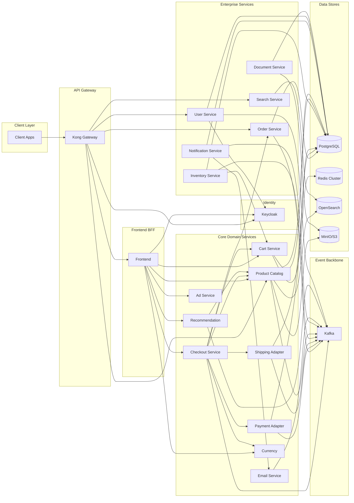
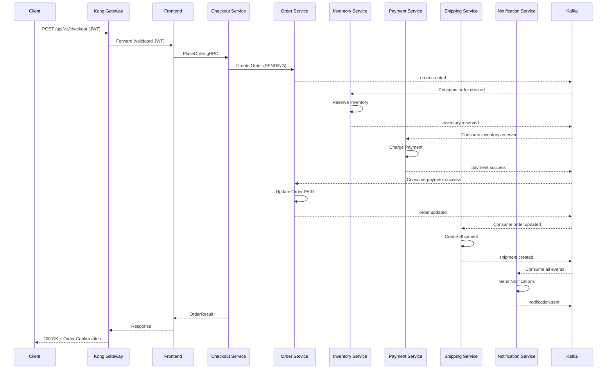
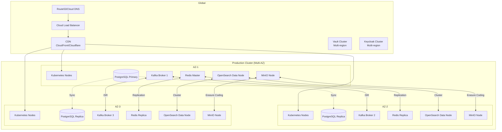
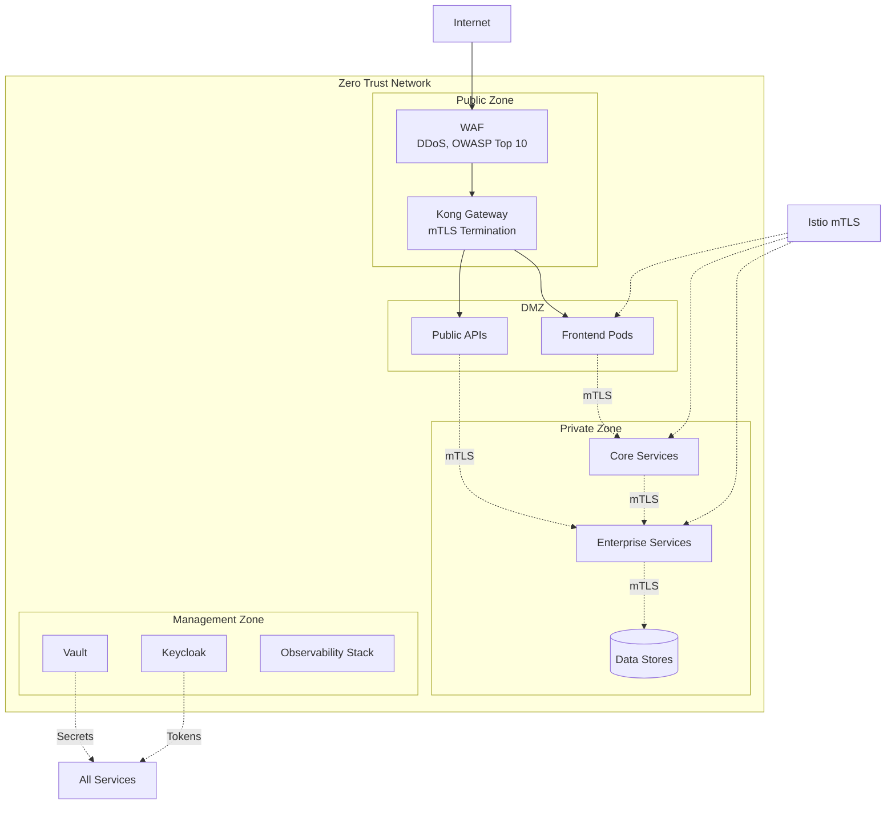
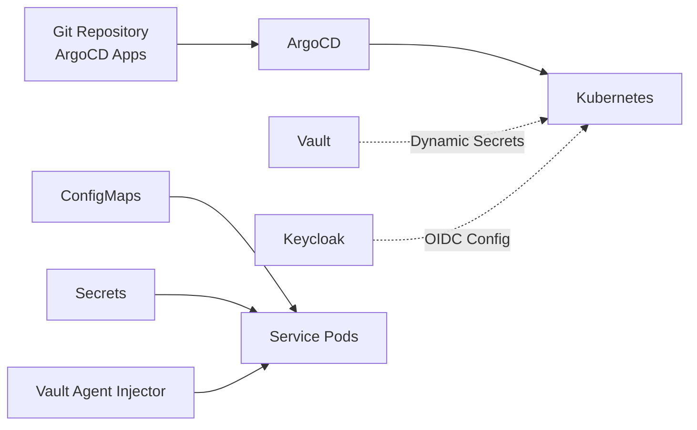

# Enterprise Architecture Design

## Executive Summary

This document presents the target enterprise architecture for transforming the Google Online Boutique into a production-ready e-commerce platform. The design preserves the existing microservices foundation while adding enterprise capabilities: identity management, transactional persistence, event-driven architecture, API management, search, object storage, and comprehensive observability.

---

## Architectural Principles

| Principle | Application |
|-----------|-------------|
| **Preserve Existing Boundaries** | Keep 11 original services, extend don't replace |
| **API-First** | All new capabilities exposed via versioned APIs |
| **Event-Driven** | Async communication via Kafka for decoupling |
| **Data Ownership** | Each service owns its data, no shared databases |
| **Security by Default** | mTLS, JWT, RBAC, audit logging everywhere |
| **Observability First** | Metrics, logs, traces as first-class concerns |
| **Resilience by Design** | Circuit breakers, retries, bulkheads, graceful degradation |
| **Cloud-Native** | Kubernetes-native, 12-factor, GitOps deployable |

---

## High-Level Architecture

```mermaid
graph TB
    subgraph "External Clients"
        Browser[Web Browser]
        Mobile[Mobile App]
        Partner[Partner APIs]
    end

    subgraph "Edge Layer"
        Kong[Kong API Gateway\nJWT Auth | Rate Limit | Routing]
        WAF[WAF\nModSecurity]
    end

    subgraph "Identity"
        Keycloak[Keycloak\nOIDC | SSO | RBAC]
        Vault[HashiCorp Vault\nSecrets Management]
    end

    subgraph "Platform Services"
        UserSvc[User Service]
        OrderSvc[Order Service]
        InventorySvc[Inventory Service]
        NotificationSvc[Notification Service]
        SearchSvc[Search Service]
        DocumentSvc[Document Service]
        AdminSvc[Admin Service]
        AnalyticsSvc[Analytics Service]
    end

    subgraph "Core Services (Extended)"
        Frontend[Frontend\nBFF + Session]
        CartSvc[Cart Service\nRedis + PG]
        CatalogSvc[Product Catalog\nPG + OpenSearch]
        CheckoutSvc[Checkout Service\nSaga Orchestrator]
        PaymentSvc[Payment Adapter\nStripe/Adyen]
        ShippingSvc[Shipping Adapter\nFedEx/UPS]
        EmailSvc[Email Service\nEvent Consumer]
        RecommendationSvc[Recommendation Service\nML-based]
        AdSvc[Ad Service]
        CurrencySvc[Currency Service]
    end

    subgraph "Data Layer"
        PostgreSQL[(PostgreSQL\nPrimary + Replicas)]
        Redis[(Redis Cluster\nCart Cache)]
        Kafka[Kafka Cluster\nEvent Streaming]
        OpenSearch[(OpenSearch\nSearch & Analytics)]
        MinIO[(MinIO/S3\nObject Storage)]
    end

    subgraph "Observability"
        Prometheus[Prometheus\nMetrics]
        Grafana[Grafana\nDashboards]
        Loki[Loki\nLogs]
        Tempo[Tempo\nTraces]
        Alertmanager[Alertmanager\nAlerting]
    end

    subgraph "Infrastructure"
        K8s[Kubernetes\nGKE/EKS/AKS]
        Istio[Istio Service Mesh\nmTLS | Traffic Mgmt]
        CertManager[cert-manager\nTLS Certificates]
    end

    Browser --> WAF --> Kong
    Mobile --> Kong
    Partner --> Kong
    
    Kong --> Frontend
    Kong --> UserSvc
    Kong --> OrderSvc
    Kong --> CatalogSvc
    Kong --> SearchSvc
    
    Frontend --> Keycloak
    Frontend --> CartSvc
    Frontend --> CatalogSvc
    Frontend --> CheckoutSvc
    
    Keycloak --> Vault
    UserSvc --> Keycloak
    UserSvc --> PostgreSQL
    
    CheckoutSvc --> Kafka
    OrderSvc --> Kafka
    InventorySvc --> Kafka
    PaymentSvc --> Kafka
    ShippingSvc --> Kafka
    
    Kafka --> NotificationSvc
    Kafka --> AnalyticsSvc
    Kafka --> EmailSvc
    Kafka --> SearchSvc
    
    CartSvc --> Redis
    CartSvc --> PostgreSQL
    CatalogSvc --> PostgreSQL
    CatalogSvc --> OpenSearch
    CatalogSvc --> MinIO
    OrderSvc --> PostgreSQL
    InventorySvc --> PostgreSQL
    PaymentSvc --> PostgreSQL
    NotificationSvc --> PostgreSQL
    DocumentSvc --> MinIO
    DocumentSvc --> PostgreSQL
    
    Istio -.-> Frontend
    Istio -.-> CartSvc
    Istio -.-> CatalogSvc
    Istio -.-> CheckoutSvc
    Istio -.-> OrderSvc
    Istio -.-> InventorySvc
    Istio -.-> PaymentSvc
    Istio -.-> ShippingSvc
    Istio -.-> UserSvc
    Istio -.-> NotificationSvc
    Istio -.-> SearchSvc
    
    Prometheus --> Grafana
    Loki --> Grafana
    Tempo --> Grafana
    Prometheus --> Alertmanager
```

---

## Service Interaction Diagram



---

## Data Flow: Order Placement (Saga Pattern)



---

## Technology Stack Summary

| Layer | Technology | Version | Justification |
|-------|------------|---------|---------------|
| **Container Orchestration** | Kubernetes | 1.28+ | Industry standard, cloud-agnostic |
| **Service Mesh** | Istio | 1.20+ | mTLS, traffic management, observability |
| **API Gateway** | Kong | 3.0+ | Plugin ecosystem, performance, Kong Konnect |
| **Identity Provider** | Keycloak | 24+ | OIDC, SAML, LDAP, fine-grained RBAC |
| **Secrets Management** | HashiCorp Vault | 1.15+ | Dynamic secrets, encryption as a service |
| **Primary Database** | PostgreSQL | 16+ | ACID, JSONB, extensions, mature |
| **Cache** | Redis Cluster | 7.2+ | HA, sharding, pub/sub |
| **Event Streaming** | Apache Kafka | 3.6+ | Durability, ordering, replay, ecosystem |
| **Schema Registry** | Confluent/Aiven | Latest | Schema evolution, compatibility checks |
| **Search** | OpenSearch | 2.11+ | Open source, vector search, security |
| **Object Storage** | MinIO | RELEASE.2024+ | S3-compatible, erasure coding, multi-site |
| **Metrics** | Prometheus | 2.47+ | CNCF graduated, Kubernetes-native |
| **Visualization** | Grafana | 10.2+ | Rich dashboards, alerting, Loki/Tempo integration |
| **Logs** | Loki | 2.9+ | Cost-effective, label-based, Grafana-native |
| **Traces** | Tempo | 2.3+ | Object storage backend, TraceQL |
| **Alerting** | Alertmanager | 0.26+ | Deduplication, grouping, inhibition |
| **CI/CD** | GitHub Actions + ArgoCD | Latest | GitOps, progressive delivery |
| **IaC** | Terraform | 1.7+ | Multi-cloud, state management |

---

## Deployment Architecture



---

## Security Architecture



---

## Network Policies

```yaml
# Example NetworkPolicy for Order Service
apiVersion: networking.k8s.io/v1
kind: NetworkPolicy
metadata:
  name: order-service-netpol
  namespace: production
spec:
  podSelector:
    matchLabels:
      app: order-service
  policyTypes:
  - Ingress
  - Egress
  ingress:
  - from:
    - namespaceSelector:
        matchLabels:
          name: api-gateway
    - podSelector:
        matchLabels:
          app: checkout-service
    - podSelector:
        matchLabels:
          app: notification-service
    ports:
    - protocol: TCP
      port: 8080
  egress:
  - to:
    - podSelector:
        matchLabels:
          app: postgresql
    ports:
    - protocol: TCP
      port: 5432
  - to:
    - podSelector:
        matchLabels:
          app: kafka
    ports:
    - protocol: TCP
      port: 9092
  - to:
    - namespaceSelector:
        matchLabels:
          name: istio-system
    ports:
    - protocol: TCP
      port: 15012
```

---

## Configuration Management



### Configuration Sources (Priority Order)
1. **Vault Secrets** (DB passwords, API keys, certificates)
2. **Kubernetes Secrets** (TLS certs, service account tokens)
3. **ConfigMaps** (Feature flags, non-sensitive config)
4. **Environment Variables** (Container overrides)
5. **Code Defaults** (Fallback values)

---

## Disaster Recovery

| Component | RPO | RTO | Strategy |
|-----------|-----|-----|----------|
| PostgreSQL | < 1s | < 5min | Streaming replication, Patroni failover, PITR |
| Kafka | 0 | < 2min | ISR replication (RF=3), min.insync.replicas=2 |
| Redis | < 1s | < 1min | Redis Cluster, AOF + RDB, cross-AZ replicas |
| OpenSearch | < 1s | < 5min | Cross-cluster replication, snapshots to S3 |
| MinIO | 0 | < 2min | Erasure coding, multi-site replication |
| Kubernetes | N/A | < 10min | GitOps (ArgoCD), cluster-api, backup etcd |

---

## Cost Optimization

| Strategy | Implementation |
|----------|----------------|
| **Right-sizing** | VPA recommendations, historical usage analysis |
| **Spot Instances** | For stateless workers (load generator, batch jobs) |
| **Autoscaling** | HPA (CPU/memory), KEDA (Kafka lag, custom metrics) |
| **Database** | Read replicas for queries, connection pooling (PgBouncer) |
| **Caching** | Redis for hot data, CDN for static assets |
| **Storage** | Tiered storage (hot/warm/cold), lifecycle policies |
| **Observability** | Sampling (10% traces), log level tuning, metric cardinality limits |

---

## Compliance Mapping

| Requirement | Implementation |
|-------------|----------------|
| **PCI-DSS** | Tokenized payments (no PAN storage), Vault for secrets, audit logs, network segmentation |
| **GDPR** | Data subject APIs (access, delete, portability), consent management, DPA, encryption |
| **SOC2 Type II** | Access controls, audit logging, monitoring, incident response, change management |
| **CCPA** | Same as GDPR + opt-out APIs, data inventory |

---

## Future Extensibility

| Capability | Architecture Support |
|------------|---------------------|
| **Multi-Region Active-Active** | Kafka MirrorMaker2, PostgreSQL multi-master (Citus), OpenSearch cross-cluster |
| **Marketplace/Multi-Vendor** | Vendor isolation via namespaces, shared catalog with vendor_id |
| **Subscriptions/Recurring** | New Billing Service, Stripe Billing integration, event-driven renewals |
| **ML/AI Features** | Feature store (Feast), model serving (KServe), event streaming for training data |
| **IoT/Edge** | MQTT bridge to Kafka, lightweight edge gateways |
| **Headless Commerce** | GraphQL federation (Apollo), existing REST + gRPC APIs |

---

## Decision Log Summary

| Decision | Choice | Rationale |
|----------|--------|-----------|
| API Gateway | Kong | Mature plugin ecosystem, performance, Konnect for managed control plane |
| Identity | Keycloak | Full OIDC/SAML, self-hosted, fine-grained RBAC, custom SPIs |
| Database | PostgreSQL | ACID, JSONB, extensions, mature ecosystem, cloud-managed options |
| Event Streaming | Kafka | Durability, ordering, replay, exactly-once, ecosystem |
| Search | OpenSearch | Open source, vector search, security, OpenSearch Dashboards |
| Object Storage | MinIO | S3-compatible, erasure coding, multi-site, Kubernetes-native |
| Service Mesh | Istio | mTLS, traffic management, observability, large community |
| Observability | Prometheus/Grafana/Loki/Tempo | CNCF graduated, integrated stack, cost-effective |
| Secrets | Vault | Dynamic secrets, encryption as a service, audit, multi-cloud |
| CI/CD | GitHub Actions + ArgoCD | GitOps, progressive delivery, Kubernetes-native |

---

## Conclusion

This architecture transforms the Google Online Boutique from a demo application into an **enterprise-grade e-commerce platform** by:

1. **Preserving** the proven microservices foundation and gRPC contracts
2. **Adding** enterprise capabilities as new services and infrastructure layers
3. **Extending** existing services with persistence, events, and security
4. **Implementing** industry-standard patterns: Saga, CQRS, Event Sourcing, BFF
5. **Ensuring** observability, security, resilience, and compliance from day one

The modular design allows incremental adoption: each enterprise capability can be deployed independently while maintaining backward compatibility with existing services.